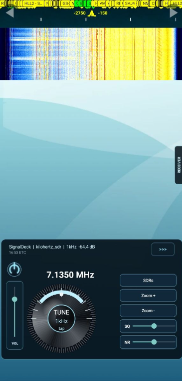
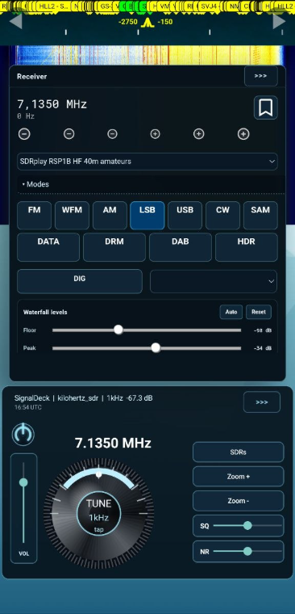
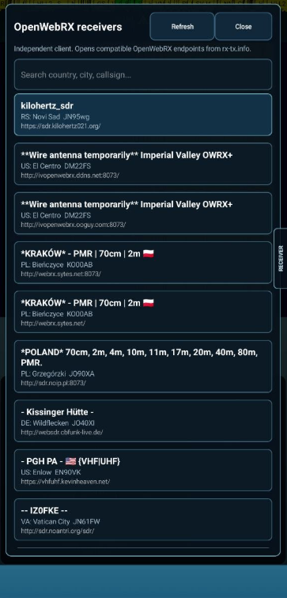

# SignalDeck Android

SignalDeck is a mobile Android client for OpenWebRX-compatible SDR receivers. It keeps the live OpenWebRX waterfall and audio engine, then adds a phone-friendly control deck for tuning, receiver selection, zoom, squelch, noise reduction, app volume, and decoder output.

SignalDeck is independent software. It is not an official OpenWebRX or OpenWebRX+ Android app.

## Download

Latest APK:

```text
https://kilohertz021.org/signaldeck/SignalDeck-latest.apk
```

Current public test version:

```text
0.1.27
```

Versioned APK:

```text
https://kilohertz021.org/signaldeck/SignalDeck-0.1.27-82f0459.apk
```

This is a direct APK test build, not a Google Play release. Android may ask you to allow installation from the browser, Telegram, or your file manager.

## Screenshots

<p align="center">
  
  
  
</p>

## What It Does

- Opens `kilohertz_sdr` by default and supports other compatible OpenWebRX receiver pages.
- Shows the original receiver waterfall, band labels, and decoded signal output.
- Adds a native mobile deck with a rotary `TUNE` knob and selectable tuning step.
- Provides `SDRs`, `Zoom +`, `Zoom -`, `SQ`, `NR`, and `VOL` controls.
- Uses a 3-second hold on the power button to fully exit the app.
- Opens receiver modes and waterfall levels from the right-side `Receiver` tab.
- Loads public receiver entries from `rx-tx.info`, with `kilohertz_sdr` pinned at the top.
- Preserves OpenWebRX decoder tables, including FT8/WSJT message text when exposed by the server.
- Respects camera cutouts, rounded screen corners, and Android navigation areas.

## Installation

1. Download the latest APK on your Android phone.
2. Open the downloaded file.
3. If Android asks to allow installation from this source, allow it for your browser, Telegram, or file manager.
4. Tap `Install`.
5. Open `SignalDeck`.

## Basic Use

- Rotate `TUNE` to change frequency.
- Tap the center of `TUNE` to change the tuning step.
- Tap `SDRs` to choose another receiver.
- Use `VOL` to adjust app/OpenWebRX audio independently from the phone volume.
- Hold the power button for 3 seconds to close the app completely.
- Open `Receiver` from the right-side tab to change modes, DIG decoder, or waterfall levels.
- Swipe the Deck or Receiver panel right from its `>>>` area to hide it.

Public SDR receivers vary. Some may be offline, overloaded, incompatible, or missing receiver state that SignalDeck can control.

## Documentation

- [User manual](USER_MANUAL.md)
- [Project notes](PROJECT.md)
- [Roadmap](ROADMAP.md)
- [Install notes](docs/install.md)
- [Background playback](docs/background-playback.md)
- [Troubleshooting](docs/troubleshooting.md)
- [Release process](docs/release.md)
- [Public positioning](docs/public-positioning.md)

## Developer Notes

This is a normal Gradle Android project.

Quick debug build:

```powershell
.\gradlew.bat assembleDebug
```

Debug APK output:

```text
app/build/outputs/apk/debug/app-debug.apk
```

## License

MIT License.
